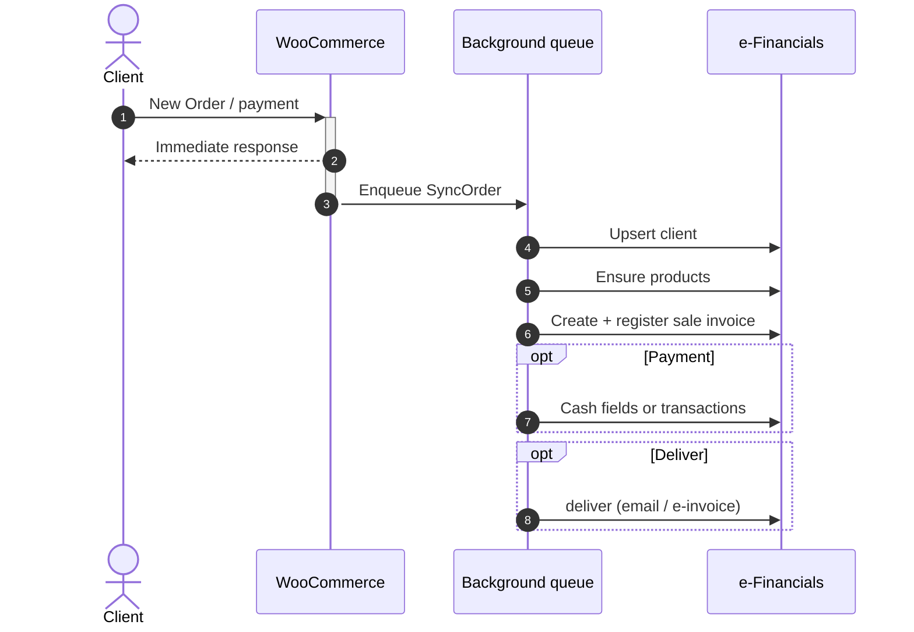

# Arbictus Sync for e-Financials and WooCommerce

WooCommerce → [e-Arveldaja / e-Financials](https://e-arveldaja.rik.ee/) bookkeeping sync.

**Workflow map** (WooCommerce hooks → e-Financials OpenAPI → `aanndryyyy/e-financials-php-client`): see [`docs/accounting-workflow.md`](docs/accounting-workflow.md).

API traffic goes through [`aanndryyyy/e-financials-php-client`](https://github.com/aanndryyyy/e-financials-php-client), installed from Packagist (`^0.1`).

## Requirements

- PHP 8.2+
- WordPress 6.5+ (tested up to 7.0)
- WooCommerce 8.2+ (tested up to 11.0), with or without High-Performance Order Storage
- e-Financials API credentials (live or demo environment)

## What this plugin does

Background (Action Scheduler / WP-Cron) sync so checkout stays fast:

1. **Client upsert** → e-Financials `clients`
2. **Products ensure** → `products` (required `products_id` on invoice rows)
3. **Sale invoice** create + **register**
4. **Payment recording** — cash fields and/or `transactions` (gateway-agnostic; uses WC payment method ids)
5. **Optional deliver** — email PDF / e-invoice
6. **Credit invoices** on full/partial refunds
7. **Admin UX** — settings, order column, metabox PDF, order actions, email note

Configure under **WooCommerce → Settings → Integrations → e-Financials**:

- **API connection** — key id, public key, password, and the live or test (demo) environment.
- **Invoicing** — invoice series, template, default sale article (required), VAT rate → sale
  article map, payment term, and whether the WooCommerce order number becomes the invoice suffix.
- **Payment recording** — default payment mode, default cash account and accounts dimension,
  and a per-gateway payment map. The series, template, sale article, cash account and dimension
  fields are dropdowns loaded from the e-Financials API once credentials are saved, so nobody has
  to look up internal ids (or mistake a ledger account number for one).
- **Delivery & products** — auto-deliver the invoice email, also send an e-invoice, and
  auto-sync products on save.

### What triggers a sync

An order is queued when WooCommerce fires `woocommerce_payment_complete`, with the order moving
to **Completed** as a fallback for gateways that never report payment. Neither trigger is
configurable. Nothing is queued until API credentials are set, and an order that already has a
sale invoice is skipped. Full and partial refunds queue a credit invoice. Sync and deliver can
also be run by hand from the order actions.

## Sequences

Main goal of the integration is to be invisible for the end user. Processing and sending data to e-Financials happens in the background.

### New Order



### Products

Products are synchronised using product meta `_ef_products_id` and e-Financials `products_id`. Opt-in auto-sync on product save is available in settings. Shipping/fees use shared generic products (`WC-SHIP`, `WC-FEE`).

### Invoicing

Sale invoices are created via the OpenAPI client, then registered. System PDFs can be downloaded from the order screen. Optional auto-deliver emails the customer after register.

### Invoice Series

Choose invoice series + template in settings before the first sync. The series' number prefix is sent as `number_prefix`, so invoices follow the accountant's numbering. Optionally push the WooCommerce order number as `number_suffix` — it is reduced to digits, because the API rejects non-numeric invoice numbers.

### VAT

Line VAT rates are read from WooCommerce's own tax rows; nothing is inferred from the tax/net ratio. e-Financials books VAT by *sale article*, not by the row's `vat_rate`, so a mixed-rate catalogue needs the **VAT rate → sale article map**. A sync fails loudly rather than posting tax into the wrong VAT-return bucket when a line's rate does not match its article.

The default sale article is **required**: `products/create` is rejected with "Please select sales account or purchases account" without it.

### Refund credit invoices

A refund posts a credit sale invoice linked to the original. Three undocumented API rules
govern it, all verified end-to-end against the demo tenant (2026-08-03):

- `sale_invoice_type` comes from `EFinancialsClient\Enums\SaleInvoiceType`, which spells the
  value the server actually branches on — hyphenated `CREDIT-INVOICE`. The field is neither
  documented nor validated, so any other spelling skips the credit branch, the credit number
  is never derived, and the request dies with HTTP 500 (`null value in column "number"`). An
  earlier revision of this plugin sent `CREDIT_INVOICE`, which is what that 500 was; it is
  not a server bug.
- The credit repeats the **original's** `number_suffix`. The server derives the number
  itself by appending `K` — and `K2`, `K3`, … for further partial credits against the same
  original, so multiple partial refunds are safe.
- The credited quantity carries the sign: `amount` is negative, `unit_net_price` positive.
  The server recomputes the row and invoice totals as negative.

Over-crediting is refused per row with a 409, and voiding a credit does not give the
capacity back. API error text is sanitised and truncated before it reaches an order note,
so the raw server traceback is never shown to customers.

## Development

The repository ships a devcontainer (PHP 8.2) — run PHP and Composer commands inside it.
The local WordPress runs on [`wp-env`](https://www.npmjs.com/package/@wordpress/env), which
needs Docker.

```bash
composer install        # the plugin loads vendor/autoload.php, so this is required
npm install
npm start               # wp-env: http://localhost:8888 (admin / password)
npm run import:demo     # optional WooCommerce sample products
```

Tests and static analysis:

```bash
composer test           # unit tests + PHPCS, PHPStan and Psalm
composer test:unit      # PHPUnit only (tests/unit)
composer test:static    # PHPCS, PHPStan, Psalm
npm run test:e2e        # Playwright against wp-env (excludes @live)
npm run test:e2e:live   # real calls to the e-Financials demo API; needs credentials
```

PHPStan and Psalm live in `vendor-bin/` via `bamarni/composer-bin-plugin`. See
[`tests/e2e/README.md`](tests/e2e/README.md) for the e2e conventions and the environment
variables the live suite reads.

## Demo in WordPress Playground

Every pull request gets a one-click, throwaway demo of that branch in
[WordPress Playground](https://developer.woocommerce.com/2025/01/24/demo-your-woo-extension-with-wordpress-playground/):
WordPress runs in the browser via WebAssembly, with WooCommerce, this plugin, demo products,
a customer and three orders in different states. The store is seeded as an Estonian shop
(EUR, 22% VAT) and the WooCommerce setup wizard is skipped, so the demo lands directly on the
e-Financials integration settings.

- `blueprints/blueprint.json` — the Playground blueprint (site setup + demo data). Edited by
  hand; the trunk build is pinned to `playground-builds/main.zip`.
- `.github/workflows/playground.yml` — builds the plugin zip (with `vendor/`, without dev
  files), publishes it to the orphan `playground-builds` branch, and comments the demo link
  on the pull request.

The zip is served from `raw.githubusercontent.com` because Playground fetches it from the
browser and that host sends `access-control-allow-origin: *`. `playground.wordpress.net`'s
own `plugin-proxy` is not an option here — it only allowlists the `wordpress`, `automattic`
and `woocommerce` organisations.

**No e-Financials API calls happen in Playground.** The plugin talks to the API over Guzzle,
which does not reach the network from WebAssembly, so the demo covers the admin UI, settings
and order screens — not live syncing.

## Releasing to WordPress.org

The plugin is published as **`arbictus-sync-for-e-financials-and-woocommerce`**. That slug is also the text
domain and the main file name, and it must stay in sync with all three.

```bash
composer build          # dist/arbictus-sync-for-e-financials-and-woocommerce.zip, built from .distignore
```

The script installs production-only dependencies, refuses to build when the plugin header
`Version` and the readme.txt `Stable tag` disagree, and fails if the zip would exceed the
10 MB submission limit. Verify a build the way the review team does, using
[Plugin Check](https://wordpress.org/plugins/plugin-check/) inside `wp-env`:

```bash
npm start
npx wp-env run cli wp plugin install <path-to-zip> --force
npx wp-env run cli wp plugin check arbictus-sync-for-e-financials-and-woocommerce \
  --categories=general,plugin_repo,security,performance,accessibility --include-experimental
```

Releases are cut by tagging and publishing a GitHub release whose tag matches both version
fields; `.github/workflows/deploy-wordpress-org.yml` then pushes trunk, the tag and the
`/assets` directory to SVN. Copy-only changes (readme wording, screenshots, a "Tested up to"
bump) go out through `.github/workflows/update-wordpress-org-assets.yml` on push to `main`.
Both need the `SVN_USERNAME` / `SVN_PASSWORD` repository secrets.

Plugin page artwork lives in `.wordpress-org/` and never ships inside the zip. It is
generated, not hand-drawn:

```bash
node bin/assets/render.mjs        # icon + banner PNGs from bin/assets/mark.svg
npx wp-env run cli wp eval-file \
  wp-content/plugins/<dir>/bin/assets/seed-screenshots.php
node bin/assets/screenshots.mjs   # screenshot-1..3 from the running admin

# The seed wipes orders and fills in the integration settings. Reset it before
# running e2e again — the suite expects an unconfigured settings screen.
npx wp-env run cli wp option delete woocommerce_efinancials_integration_settings
```

## License

Copyright (c) 2026 Arbictus OÜ.

Free software under **[GPL-2.0-or-later](LICENSE)**. The plugin runs inside WordPress
(GPL-2.0-or-later) and WooCommerce (GPL-3.0-or-later), so it is a derivative work and is
distributed under GPL-compatible terms — as it must be.

There is no restriction on production use, company size, or revenue, and no non-profit
versus commercial distinction. You may run it on any number of sites, modify it, and
redistribute it under the same terms, free of charge and forever.

Releases are distributed free through the
[WordPress.org plugin directory](https://wordpress.org/plugins/arbictus-sync-for-e-financials-and-woocommerce/),
so every install updates at no cost and there is no licence key or premium build. Paid
subscriptions cover **support only** — a service, never permission to use the code, and
never access to functionality. See **[COMMERCIAL.md](COMMERCIAL.md)**. When a subscription
lapses the plugin keeps working and keeps updating; you simply stop receiving support.

The "Arbictus" name and logo, and the product name "Arbictus Sync for e-Financials and WooCommerce", are
trademarks and are not licensed by the GPL. Forks are welcome under a different name.

## Disclaimer

Independent, unofficial integration built against a public REST API. Not affiliated with,
endorsed by, or supported by Registrite ja Infosüsteemide Keskus (RIK), or by Automattic, Inc.
